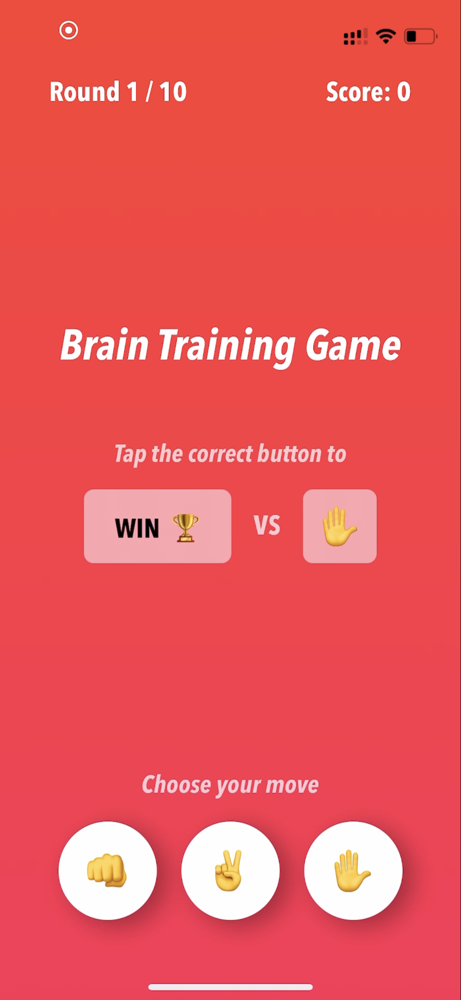

# SwiftUI - Brain Training Game
A game where the player has to select the correct rock 👊️, paper ✋ or scissors ✌️ move to collect points.

The game has ten rounds and will ask the user for a "losing" or "winning" move, meaning that the player could lose points 
if they select "rock against scissors" instead of "paper against scissors" if the game requests a "losing" move.

This game was developed as a challenge for Day 25 of 100 Days of Swift. More information available on 
[Hacking With Swift](https://www.hackingwithswift.com/guide/ios-swiftui/2/3/challenge).